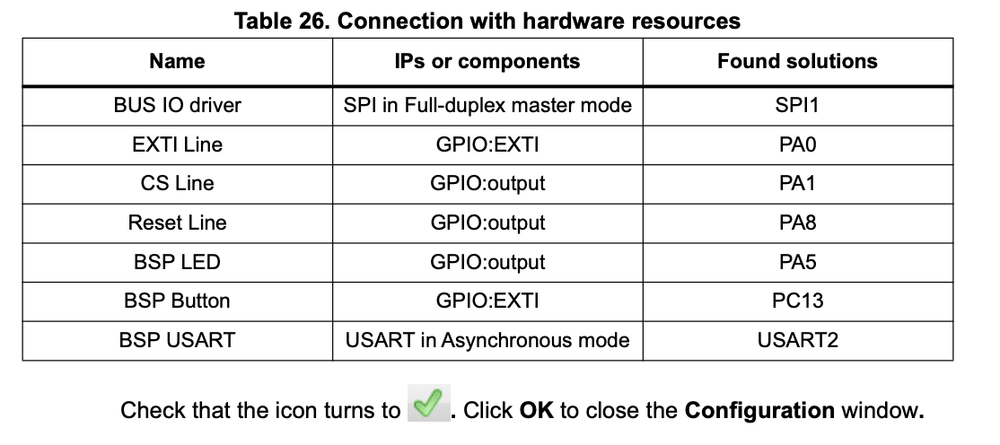
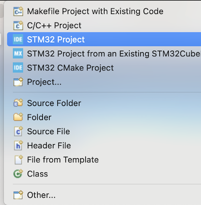
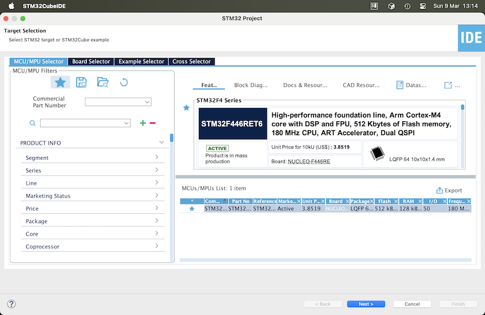
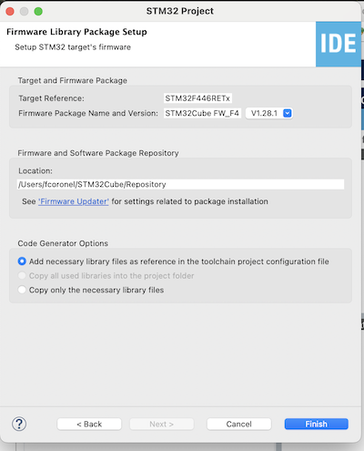
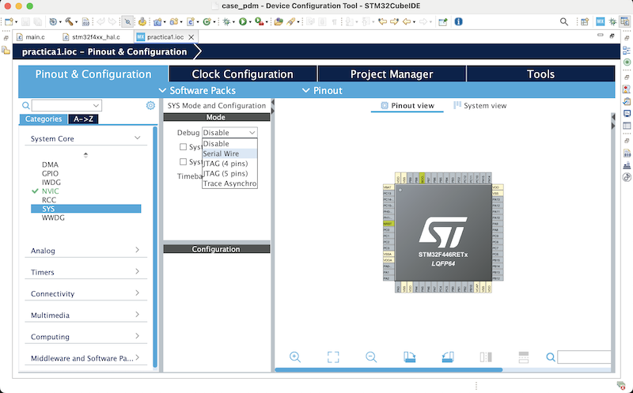
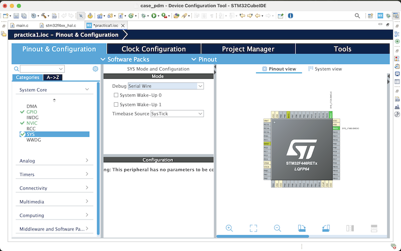
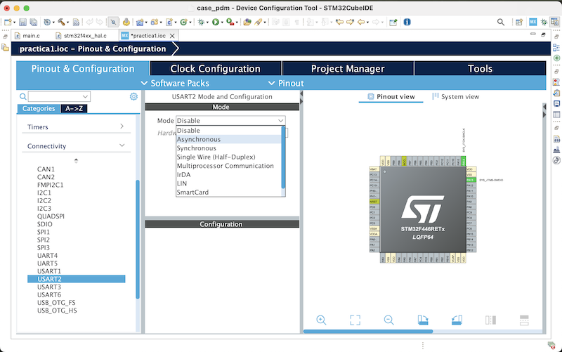
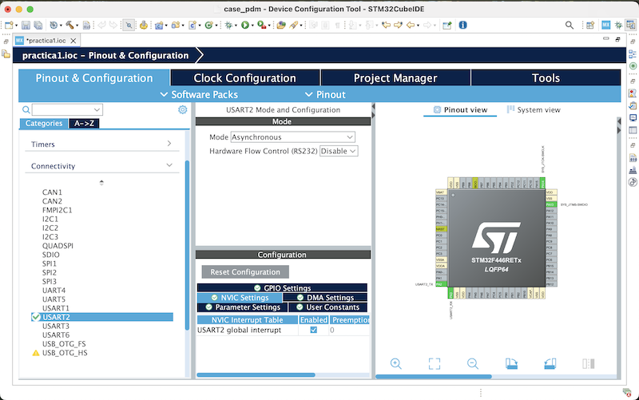

#  [CESE] Programación de Microcontroladores

Repositorio de las prácticas de la materia [Programación de Microcontroladores](https://sites.google.com/cursoscapse.com/pdm/) para el cohorte 24Co2025 de la [Carrera de Especialización en Sistemas Embebidos (CESE)](https://lse-posgrados.fi.uba.ar/posgrados/especializaciones/cese) 

## Objetivo

Practicas desarrollados para la placa [STM32F446RE](https://www.st.com/en/evaluation-tools/nucleo-f446re.html).

## Documentación del producto

- [NUCLEO-XXXXRX schematic](docs/mb1136-nucleo-xxxxrx-block-diagrams-default-c04_schematic.pdf)

- [PM0214 - Programming manual - STM32 Cortex®-M4 MCUs and MPUs programming manual](docs/pm0214-programming-manual-stm32-cortexm4-mcus-and-mpus-programming-manual-stmicroelectronics.pdf)

- [RM0390 - Reference manual - STM32F446xx advanced Arm®-based 32-bit MCUs](docs/rm0390-reference-manual-stm32f446xx-advanced-arm-based-32-bit-mcus-stmicroelectronics-en.pdf)

- [STM32F446xC/E Manual](docs/stm32f446re.pdf)

- [UM1718 - STM32CubeMX for STM32 configuration and initialization C code generation - User manual](docs/um1718-stm32cubemx-for-stm32-configuration-and-initialization-c-code-generation-stmicroelectronics.pdf)

- [UM1724 User manual STM32 Nucleo-64 boards (MB1136)](docs/um1724-user_manual-dm00105823.pdf)

- [UM1725 User manual Description of STM32F4 HAL and low-layer drivers](docs/um1725-user-manual-dm00105879-description-of-stm32f4-hal-and-lowlayer-drivers-stmicroelectronics.pdf)

- [UM2609 STM32CubeIDE user guide - User manual](docs/um2609-stm32cubeide-user-guide-stmicroelectronics.pdf)

- [UM3461 STM32F4 series UL/CSA/IEC 60730-1/60335-1 self-test library user guide  - User manual](docs/um3461-stm32f4-series-ulcsaiec-607301603351-selftest-library-user-guide-stmicroelectronics.pdf)

## Software necesario

- [STM32CubeIDE](https://www.st.com/en/development-tools/stm32cubeide.html): Integrated Development Environment for STM32

## Configuración común de practicas

Dependiendo del practicas, crear la asocicación al PIN correspondiendo con un nombre lógico

_(fuente: **STM32CubeMX User Manual**: Tutorial 7 – Using the X-Cube-BLE1 software pack_)_

_**tip**: en caso de necesitar confirmar la conexión vea la sección **Verificar la conexión** [TROUBLESHOOTING.md](TROUBLESHOOTING.md#verificar-la-conexión)_

1. Crear un "STM32 Project"  
    

2. **Target Selection**  
    Elegir la placa STM32 conectada
    

3. **Firmware Library Package Setup**  
    Seleccionar _Add necessary library files as reference in the toolchain project configuration file_ y generar el proyecto.  
    

4. **Pinout & Configuration**  
    Pantalla de configuración IOC.
    

5. **Activar _Modo Debug_**  
    1. En `System Core` seleccionar `SYS`
    2. Cambiar `Debug` a `Serial Wire`

    

6. Guardar para generar  
    

7. **Activar la conectividad _USART2_**  
    1. En `Connectivity` seleccionar `USART2`
    2. Cambiar `Mode` a `Asynchronous`
    

8. **Activar global interrupt en _NVIC Settings_**  
    

