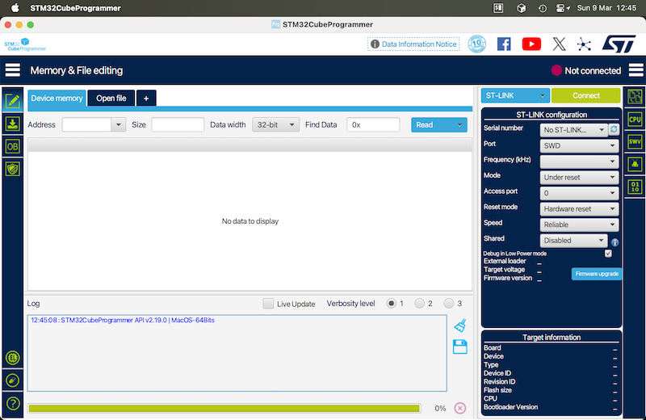
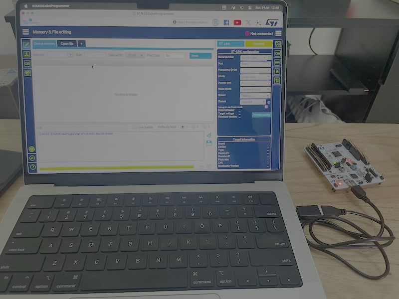
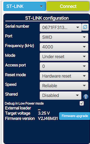
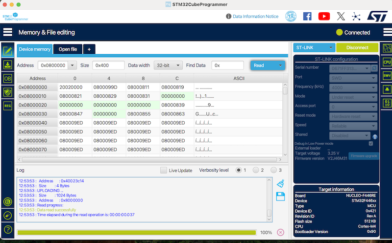

#  [CESE] [Troubleshooting] Programación de Microcontroladores

## Software necesario

- [STM32CubeProg](https://www.st.com/en/development-tools/stm32cubeprog.html): STM32CubeProgrammer software for all STM32

## Verificar la conexión

1. Abrir STM32CubeProgrammer  
Verificar que no haya conexión alguna detectada

2. Conectar la placa STM32  
Confimar que se activa

3. Hacer refresh de la detección 🔄  
Verificar que no haya conexión alguna detectada

4. Conectar con la placa  
Confirmar la conexión exitosa

5. Desconectar la placa
