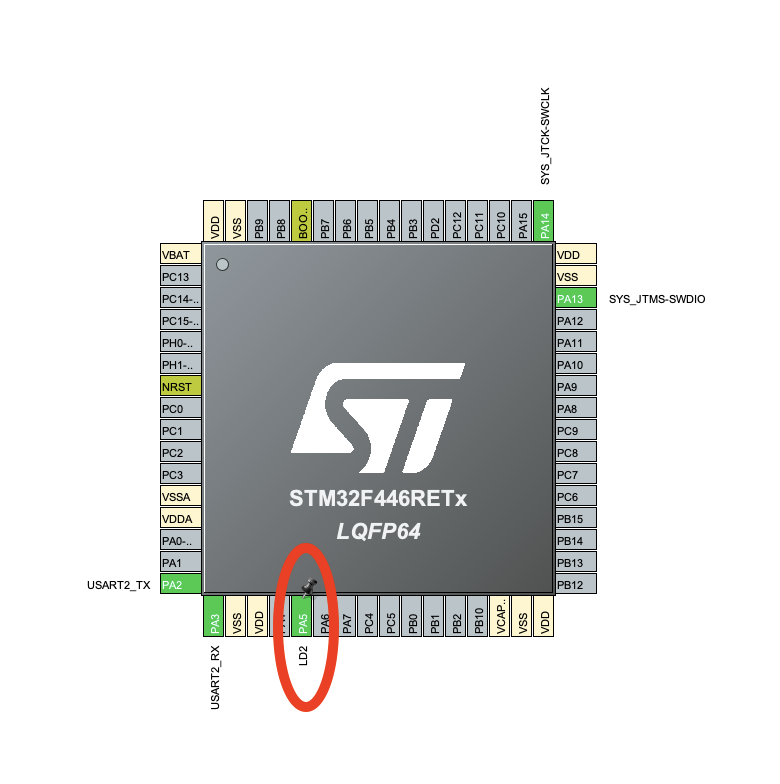

# Practica 0

Practica base para probar la configuración del entorno de desarrollo SMT32CubeIDE.

## Funcionalidad

La funcionalidad implementada realiza el alternado del _LED2_ (Pin `PA5`) cada 1s con duty cycle 50%, para diferenciarlo del comportamiento de fabrica del LED2

## Configuración

1. Asociar `LD2` al PIN `GPIO:PA5`

