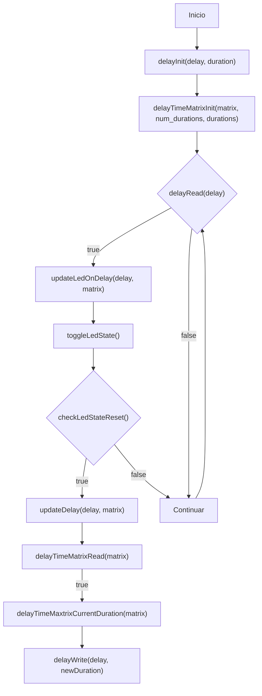
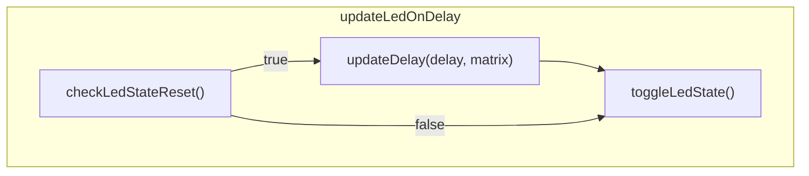
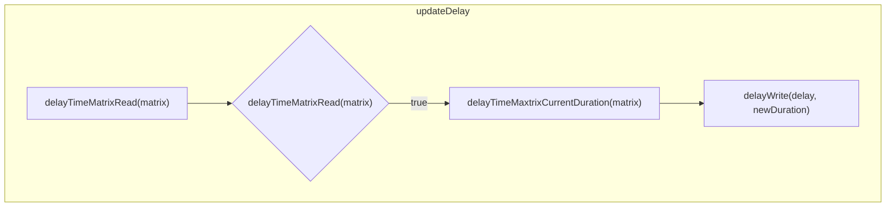

# Practica 2

El enunciado del ejercicio esta [acá](enunciado.md)

## Configuración

Agregar al include path `Drivers/API/Inc`

## Documentación por Doxygen

La documentación por Doxygen se encuentra en [docs](docs/html/index.html) generada con:

```
doxygen Doxyfile
```


## Diagrama de flujo






