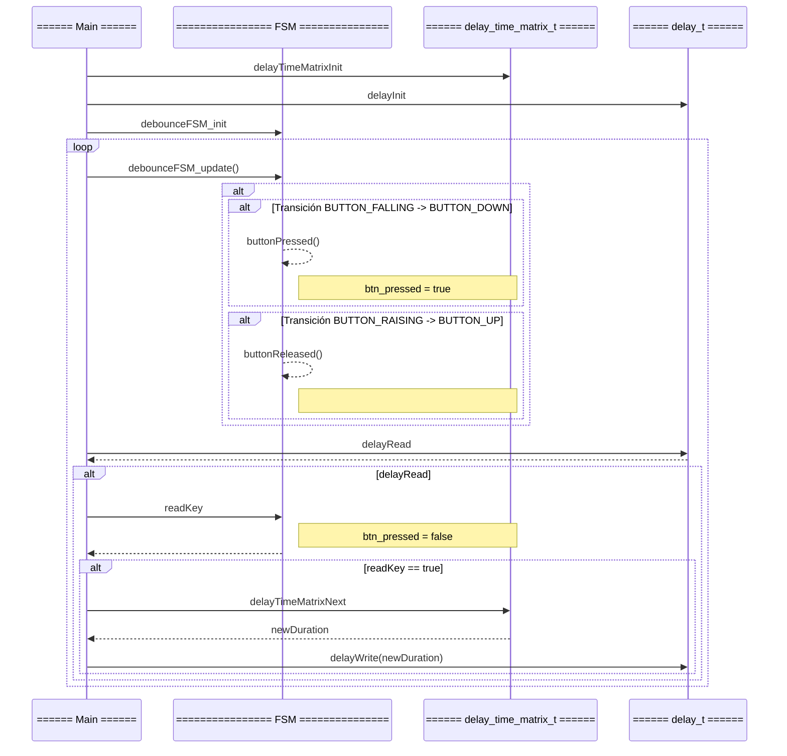
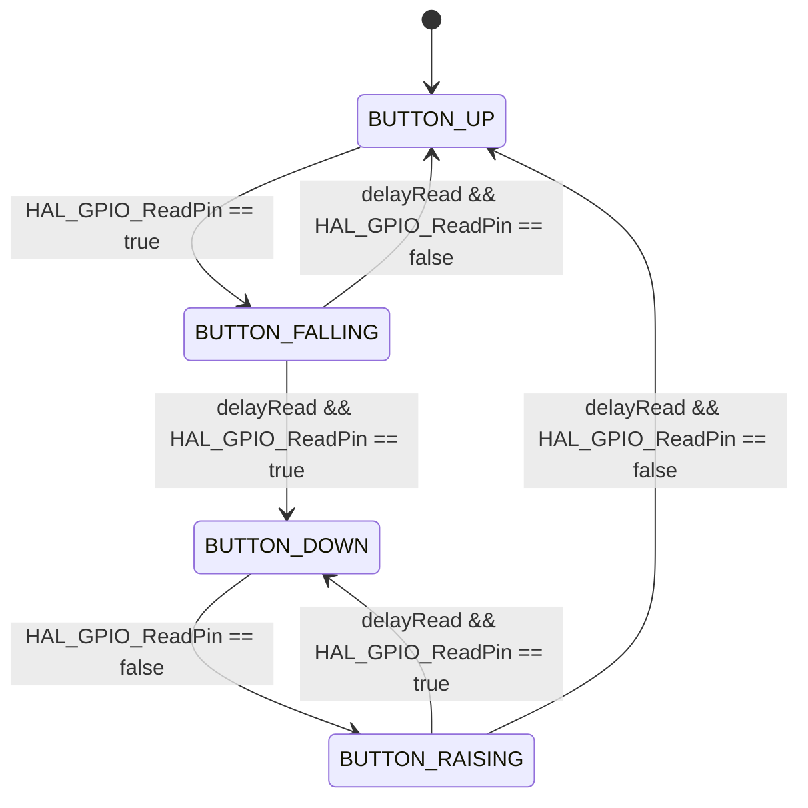

# Practica 4

El enunciado del ejercicio esta [acá](enunciado.md)

## Configuración

## Include Path

Agregar al include path `API/Inc`

### Pinout

1. Setear el label `LD2` para el PIN `GPIO:PA5` en `GPIO_Output`
1. Setear el label `BTN` para el PIN `GPIO:PC13` en `GPIO_EXTI13`
1. `GPO` -> `NVIC` -> EXTI Line Interrupt


## Documentación por Doxygen

La documentación por Doxygen se encuentra en [docs](docs/html/index.html) generada con:

```
doxygen Doxyfile
```

## Diagramas

### sequencia de llamadas



### Diagrama de estado debounceFSM



