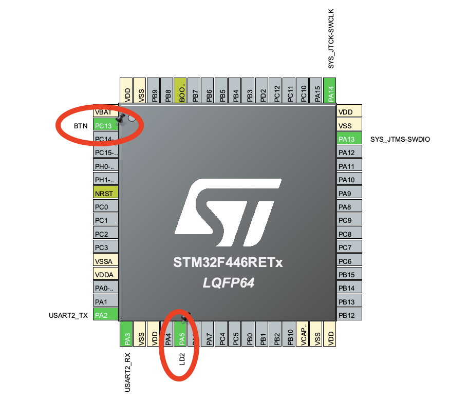

# RFID Reader

## Self test

The MFRC522 has the capability to perform a digital self test. The self test is started by
using the following procedure:

### 1. Perform a soft reset.
    * op: write 
    * registry: `01h` `CommandReg`
    * value: `1111`
    * address: `
### 2. Clear the internal buffer by writing 25 bytes of 00h and implement the Config command.
### 3. Enable the self test by writing 09h to the AutoTestReg register.
### 4. Write 00h to the FIFO buffer.
### 5. Start the self test with the CalcCRC command.
### 6. The self test is initiated.
### 7. When the self test has completed, the FIFO buffer contains the following 64 bytes


# Practica 5

El enunciado del ejercicio esta [acá](enunciado.md)

## Detalles de la solución

En `main.c` se desactiva `MX_USART2_UART_Init` para asegurar que `API_uart#uartInit()` es la responsable de configurar la `UART`.

```c
static void MX_USART2_UART_Init(void)
{

  /* USER CODE BEGIN USART2_Init 0 */

  return; /**< Reemplazado por API_uart#uartInit() */

  /* USER CODE END USART2_Init 0 */

  •••••••
}

```

## Configuración

### Paths

1. Asegurarse que el path `API` este definido como Source Path.
1. Agregar al include path `API/Inc`

### Pinout

1. Setear el label `LD2` para el PIN `GPIO:PA5` en `GPIO_Output`
1. Setear el label `BTN` para el PIN `GPIO:PC13` en `GPIO_EXTI13`
1. `GPO` -> `NVIC` -> EXTI Line Interrupt



## Documentación por Doxygen

La documentación por Doxygen se encuentra en [docs](docs/html/index.html) generada con:

```sh
doxygen Doxyfile
```
